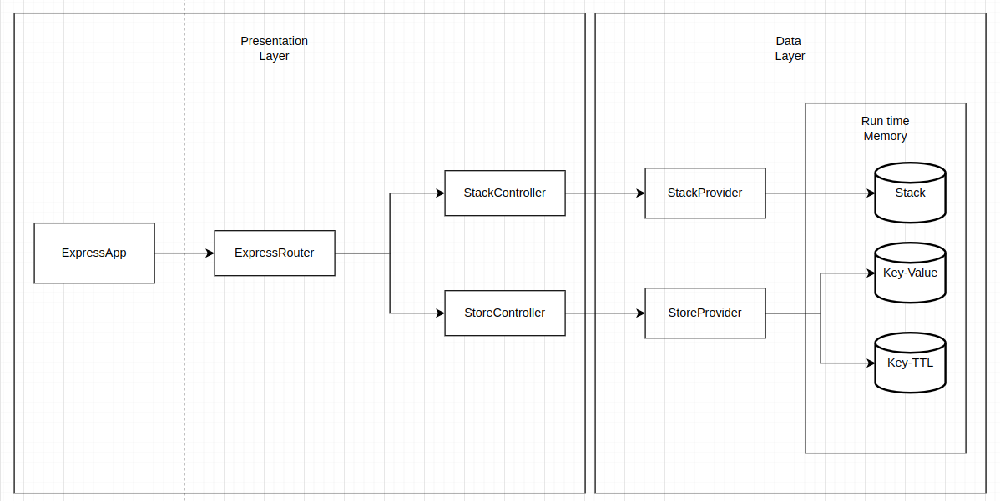

# Memory Storage

This is a backend code challenge to build a simple API developed using the ExpressJS framework

The original challenge description is in the file _challenge_description.md_
 > https://github.com/carlosviniciusfernandes/tmg_nodejs_test/blob/master/challenge_description.md

---
## Installation
The installation of the is done by executing the following commands:

> npm install

__NOTE__: You can use other node package managers like `Yarn`, but for simplicity `NPM` is used here as example

---
## The API
The API operates on two unrelated pieces of functionality, one is a in memory stack, and the other a key-value in memory store. Both of them are not persisted, so be aware that data is lost when the application is turned down or restarted.

### Design

The design choices was to go with a simple approach, with two separate controllers for the distinct pieces of memory storage functionality.

The data itself is stored on the instances of `InMemoryStack` and `InMemoryStore` classes during run time, working like a Singleton like objects.

For the key-value memory storage, an additional object was created to store the optional _Time To Live_ (TTL). Once something is stored with a valid TTL, a routine will run every one second, subtract a second from the TTL and check if its reached zero, then unset the value from the storage if needed.




### Serving the Express APP
To start the app, run the following command:

> npm start

this will expose the API to the address http://localhost:3000

### API Endpoints

There are 5 exposed endpoints. Those are also documented using swagger, with the API running check http://localhost:3000/api-docs

#### Stack
Get from stack
```
method: GET
path: /stack
description: Retrieve an item from the top of the stack and remove that item

responses:
    success
        status: 200
        body: {
            "message": "item has been removed from the stack pile",
            "stackSize": integer value with the remaining stack size,
            "item": "value retrivied"
        }
    error - stack is empty
        status: 400
        body: {
            "message": "Empty stack, could not retrieve an item from it",
        }

```

Add to stack
```
method: POST
path: /stack/add
description: Add an item to the top of the stack

request body: {
  "item": "some defined value to be added"
}

responses:
    success
        status: 200
        body: {
            "message": "item has been added to the stack pile",
            "stackSize": integer value with the stack size after adding,
            "item": "some defined value to be added"
        }
    error - bad request
        status: 400
        body: {
            "message": "A valid value for 'item' must be provided",
        }

```

#### Key-Value Store
Get from store
```
method: GET
path: /store/<:key>
description: Retrieve the value of a key-value pair by its key

responses:
    success
        status: 200
        body: {
            "value": "the value stored with the given key"
        }
    error - not found (if the key does not exists, or was unset due timeout)
        status: 404
```

Add to store
```
method: POST
path: /store/add
description: Add a key-value pair do the store

request body: {
  "key": string that maps to the 'value',
  "value": "some defined value",
  "ttl": optional integer value in seconds of the time to live for key-value,
}

responses:
    success
        status: 200
    error - bad request
        status: 400
        body: {
            "message": "Validation error",
        }
```

Delete from store
```
method: DELETE
path: /store/<:key>
description: Remove a value from the store by its key

responses:
    success
        status: 200
    error - not found (if the key does not exists, or was unset due timeout)
        status: 404
```

---
## Running Tests
The tests are using `Jest` as the test runner. To run the test, execute the following command:
> npm test
